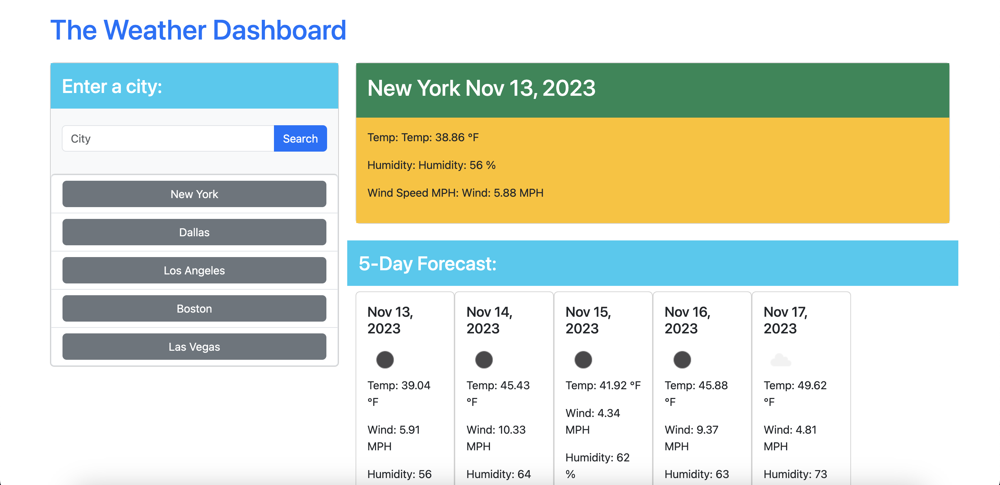

# WEATHER DASHBOARD

## Description
The Weather Dashboard is a web application built with HTML, CSS (Bootstrap), and JavaScript. It allows users to search for a city and view the current weather conditions as well as a 5-day forecast.

## Table of Contents
* [Description](#description)
* [Installation](#installation)
* [Links](#links)
* [Licenses](#license)
* [Badges](#badges)
* [Credits](#credits)
* [Tests](#tests)
* [Questions](#questions)

## Installation
No specific installation steps are required. Simply open the project in your web browser.

## Links
[Github Repo](https://github.com/brennysouza/weather-api-x)

[Deployed Site](https://brennysouza.github.io/weather-api-x/)

[Link to video walkthrough](https://drive.google.com/file/d/1mjf1FoTywyZM7HFKhMRnl74kxZmB8DCm/view)

## License

## Badges
NA

## Credit
Help was received from askBCS tutor Charles Siwele who helped with saving the searched cities to display under the search bar inside a container.

## Tests
NA

## Questions
Feel free to reach me at any time by these two contact methods below should you have any additional questions, comments, or concerns!

- GitHub Username: [brennysouza](https://github.com/brennysouza)
- Email: brennysouza@protonmail.com 

